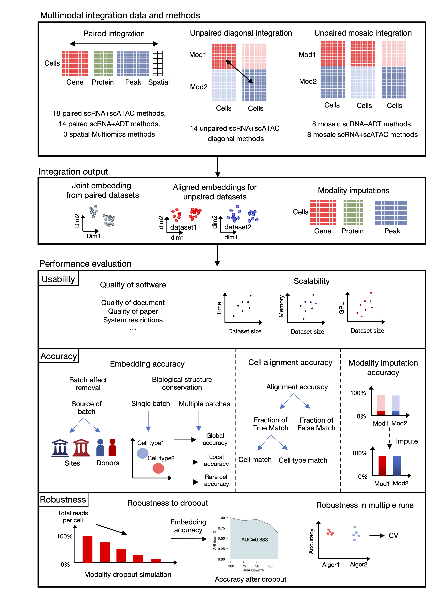
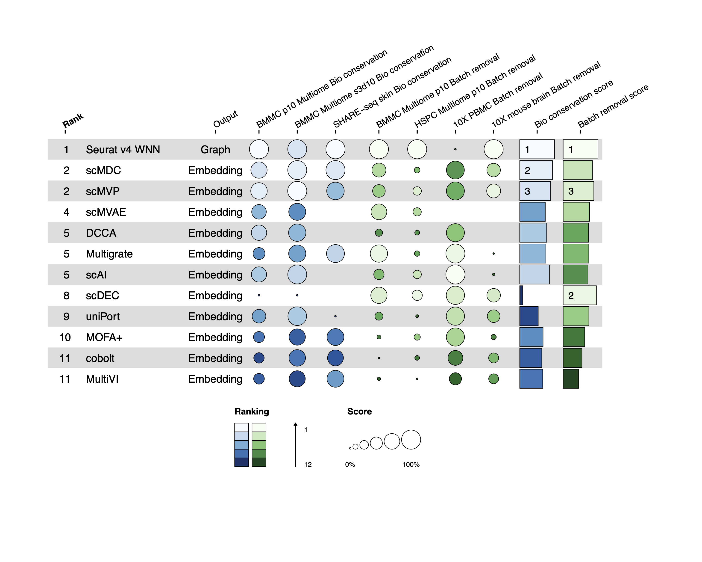

# Single-cell Multi-modal Integrations Benchmark (SCMMIB)

## SCMMIB introduction

SCMMIB project provided a benchmark workflow for evaluating the usability, accuracy, robustness and scalability of single-cell multimodal integration algorithms, including 65 single-cell multi-modal integration methods in 40 algorithms involving modalities of DNA, RNA, protein and spatial multi-omics for paired integration, unpaired diagonal integration, and unpaired mosaic integration.

- This folder contains [scmmib package](scmmib) for computing SCMMIB benchmark evaluation metrics;
-  And [figure reproducibility code](manuscript_figure_script_and_data) for manuscript figures in stage 2 project. The scripts and datasets analyzed in stage 1  are archived [here](https://github.com/bm2-lab/SCMMI_Benchmark/tree/stage1). The registered stage 1  manuscript is available at Nature Methods Register Report [Figshare](https://springernature.figshare.com/articles/journal_contribution/Benchmarking_single-cell_multi-modal_data_integrations/26789572). 

- Our website for benchmark results visualization is available at [SCMMIB_website](https://bm2-lab.github.io/SCMMIB-reproducibility/).
- For reproducibility of benchmark methods, metrics and visualization, we had a GitHub repository at [SCMMIB_pipeline](https://github.com/bm2-lab/SCMMIB_pipeline).


## SCMMIB workflow


## SCMMIB package
We developed a python package `scmmib` based on `scanpy` pipeline, which referred to some integration metrics in `scib` and `scglue` package, and extended to different single-cell multimodal integration tasks. <br> 

The `knn_smooth` function  in scmmib package was sourced  from a public knn smoothing method:
[knn_smoothing paper](https://www.biorxiv.org/content/10.1101/217737.full.pdf), and [github](https://github.com/yanailab/knn-smoothing). <br>

We provided  [3 demo cases](docs/scmmib_demo.ipynb) and [reference manual](docs/scmmib_py_manual.md) for using the `scmmib` package. <br>

`scmmib` package also includes a simplified summary visualization tool  `plot_scmmib_table.r` in R. <br>

### Dependencies
- Python >=3.8, `scib, scglue, scanpy` for `scmmib` python package.
- R >=3 and `dplyr, scales, ggimage,ggplot2, cowplot` for `plot_scmmib_table.r` R tool.

### Installation </br>
1. Preparing the envrionment. </br>
- **Option 1:** install dependencies
- for example, for python package, three dependencies can be install with pip
```Bash
pip install scib scglue scanpy
```


- **Option 2:** use a conda env of mixture dependencies </br>
Th conda tool (miniconda) can be installed  from [anaconda website](https://docs.anaconda.com/miniconda/miniconda-install/).</br>
Then create and enter the conda environment.
```Bash
conda env create -f scmmib_env.yml
conda activate scmmib
```

2. Install scmmib package.
```Bash
# download SCMMIB
git clone https://github.com/bm2-lab/SCMMI_Benchmark
# set dir to folder
cd SCMMI_benchmark
pip install .
```
3. Test the installation in python
```python
import scmmib
```

#### FAQ: 
- A bug may occur for graph LISI metrics as follows:
```Bash
FileNotFoundError, [Errno 2] No such file or directory: '/tmp/lisi_svo3el2i/graph_lisi_indices_0.txt'
```
The related GitHub issue in scib project is [here](https://github.com/theislab/scib/issues/333) and a posssible [solution](https://github.com/theislab/scib/blob/main/scib/knn_graph/README.md).


#### A simplified summary visualization tool `plot_scmmib_table.r`

The `plot_scmmib_table.r` is a simplified version of summary table visualization tool, which is adapted from both [`funkyheatmap` package](https://funkyheatmap.github.io/funkyheatmap/) and `scib_knit_table` function in `scib` package, as these two tools requires complex input format and numerous input format restrictions. <br>
A demo output:


The `plot_scmmib_table.r` can be used alone with input of simple `R data.frame` format. All summary figures were generated with `plot_scmmib_table.r` tool. </br>

We provided  a [**demo noteook**](docs/scmmib_summary_table_demo.html) and [reference manual](docs/scmmib_tab_r_manual.md) for using `plot_scmmib_table.r`. <br>

More examples can be referred in [figure reproducibility code](manuscript_figure_script_and_data).

## Benchmark datasets summary
All datasets analyzed in SCMMIB study are listed below. Details of these datasets were introduced in our [stage1 manuscript](https://springernature.figshare.com/articles/journal_contribution/Benchmarking_single-cell_multi-modal_data_integrations/26789572). The processed datasets are available in a public Figshare repostiory [link](https://figshare.com/articles/dataset/SCMMIB_Register_Report_Stage_2_processed_datasets/27161451/1).

| Dataset name       | Multi-omics  | Batches                     | Species | Number of cells | sample/tissue type                                  |
|--------------------|------------------|----------------------------|---------|-------------|-----------------------------------------|
| BMMC Multiome      | scRNA + scATAC       | 12 donors from 4 sites     | Human   | 69,249      | bone marrow mononuclear cells           |
| BMMC CITE-seq      | scRNA + ADT        | 12 donors from 4  sites    | Human   | 90,261      | bone marrow mononuclear cells           |
| HSPC Multiome      | scRNA + scATAC       | 4 donors  of 5 time points | Human   | 105,942     | hematopoietic stem and progenitor cells |
| HSPC CITE-seq      | scRNA + ADT        | 4 donors of 5 time points  | Human   | 70,988      | hematopoietic stem and progenitor cells |
| SHARE-seq skin     | scRNA + scATAC       | -                          | Mouse   | 34,774      | skin                                    |
| COVID19 CITE-seq   | scRNA + ADT        | 143 donors                 | Human   | 781,123     | peripheral blood immune cells           |
|  10X PBMC   | scRNA + scATAC          | 2 samples                | Human   |  15,021     | peripheral blood immune cells           |
|  10X Mouse Brain   | scRNA + scATAC          | 2 replicates for 2 samples                | Mouse   |  12,138     | brain          |
|  Human white blood cell   | scRNA + ADT          | 8 donors of 3 time points               | Human   |  161,764     |  white blood cell         |
|  10X NSCLC   | scRNA + ADT          | 2 replicates             | Human   |  15,618     |  NSCLC         |
|  10X kidney cancer   | scRNA + ADT          | 7 donor              | Human   |  20,974     |  Kidney         |
| Lymph node spatial | spatial+scRNA+ADT  | 2 samples                  | Human   | 6,843       | lymph node                              |
| Thymus spatial     | spatial+scRNA+ADT  | 4 samples                  | Mouse   | 17,824      | thymus                                  |
| Spleen SPOTS       | spatial+scRNA+ADT  | 2 samples                  | Mouse   | 5,336       | spleen                                  |
<br>

## Benchmark Methods
All benchmark methods analyzed in SCMMIB study are listed below. Details of these methods were available in our Register Report Stage 1 manuscript in [figshare folder](https://springernature.figshare.com/articles/journal_contribution/Benchmarking_single-cell_multi-modal_data_integrations/26789572).

| Method                                                                         | Article                                                                   | Time |
|--------------------------------------------------------------------------------|---------------------------------------------------------------------------|------|
| [Liger iNMF](https://github.com/welch-lab/liger)                               | [Cell](https://doi.org/10.1016/j.cell.2019.05.006)                        | 2019 |
| [Seurat v3 CCA](https://github.com/satijalab/seurat)                            | [Cell](https://doi.org/10.1016/j.cell.2019.05.031)                        | 2019 |
| [Seurat v4 RPCA](https://github.com/satijalab/seurat)                           | [Cell](https://doi.org/10.1016/j.cell.2019.05.031)                        | 2019 |
| [Citefuse](https://github.com/SydneyBioX/CiteFuse)                             | [Bioinformatics](https://doi.org/10.1093/bioinformatics/btaa282)          | 2020 |
| [MOFA+](https://github.com/gtca/mofaplus-shiny)                                | [Genome Biology](https://doi.org/10.1186/s13059-020-02015-1)              | 2020 |
| [scAI](https://github.com/sqjin/scAI)                                          | [Genome Biology](https://doi.org/10.1186/s13059-020-1932-8)               | 2020 |
| [unionCom](https://github.com/caokai1073/UnionCom)                             | [Bioinformatics](https://doi.org/10.1093/bioinformatics/btaa443)          | 2020 |
| [cobolt](https://github.com/boyinggong/cobolt/blob/master/docs/tutorial.ipynb) | [Genome Biology](https://doi.org/10.1186/s13059-021-02556-z)              | 2021 |
| [DCCA](https://github.com/cmzuo11/DCCA)                                        | [Bioinformatics](https://doi.org/10.1093/bioinformatics/btab403)          | 2021 |
| [GLUE](https://github.com/gao-lab/GLUE)                                        | [Nature Biotechnology](https://doi.org/10.1101/2021.08.22.457275)         | 2021 |
| [Liger online iNMF](https://github.com/welch-lab/liger)                        | [Nature Biotechnology](https://doi.org/10.1038/s41587-021-00867-x)        | 2021 |
| [scDEC]( https://github.com/kimmo1019/scDEC)                                   | [Nature machine intelligence](https://doi.org/10.1038/s42256-021-00333-y) | 2021 |
| [scMM](https://github.com/kodaim1115/scMM)                                     | [Cell Reports Methods](https://doi.org/10.1016/j.crmeth.2021.100071)      | 2021 |
| [scMVAE](https://github.com/cmzuo11/scMVAE)                                    | [Briefings in Bioinformatics](https://doi.org/10.1093/bib/bbaa287)        | 2021 |
| [Seurat v4 WNN](https://github.com/satijalab/seurat)                            | [Cell](https://doi.org/10.1016/j.cell.2021.04.048)                        | 2021 |
| [totalVI](https://scvi-tools.org/)                                             | [Nature Methods](https://doi.org/10.1038/s41592-020-01050-x)              | 2021 |
| [MultiMAP](https://github.com/Teichlab/MultiMAP)                               | [Genome Biology](https://doi.org/10.1186/s13059-021-02565-y)              | 2021 |
| [bindSC](https://github.com/KChen-lab/bindSC)                                  | [Genome Biology](https://doi.org/10.1186/s13059-022-02679-x)              | 2022 |
| [Liger UiNMF](https://github.com/welch-lab/liger)                              | [Nature Communications](https://doi.org/10.1038/s41467-022-28431-4)       | 2022 |
| [Multigrate](https://github.com/theislab/multigrate)                           | [bioRxiv](https://doi.org/10.1101/2022.03.16.484643)                      | 2022 |
| [Pamona](https://github.com/caokai1073/Pamona)                                 | [Bioinformatics](https://doi.org/10.1093/bioinformatics/btab594)          | 2022 |
| [SAILERX](https://github.com/uci-cbcl/SAILERX)                                 | [Nucleic Acids Research](https://doi.org/10.1093/nar/gkac781)             | 2022 |
| [SCALEX](https://github.com/jsxlei/SCALEX)                                     | [Nature Communications](https://doi.org/10.1038/s41467-022-33758-z)       | 2022 |
| [sciPENN](https://github.com/jlakkis/sciPENN)                                  | [Nature machine intelligence](https://doi.org/10.1038/s42256-022-00545-w) | 2022 |
| [scMDC](https://github.com/xianglin226/scMDC)                                  | [Nature Communications](https://doi.org/10.1038/s41467-022-35031-9)       | 2022 |
| [scMVP](https://github.com/bm2-lab/scMVP)                                      | [Genome Biology](https://doi.org/10.1186/s13059-021-02595-6)              | 2022 |
| [uniPort](https://github.com/caokai1073/uniPort)                               | [Nature Communications](https://doi.org/10.1038/s41467-022-35094-8)       | 2022 |
| [scVAEIT](https://github.com/jaydu1/scVAEIT)                                   | [PNAS](https://doi.org/10.1073/pnas.2214414119)                           | 2022 |
| [MEFISTO](https://biofam.github.io/MOFA2/MEFISTO)                              | [Nature Methods](https://doi.org/10.1038/s41592-021-01343-9)              | 2022 |
| [DeepMAPS](https://github.com/OSU-BMBL/deepmaps)                               | [Nature communications](https://doi.org/10.1038/s41467-023-36559-0)       | 2023 |
| [GCN-SC](https://github.com/YuBinLab-QUST/GCN-SC)                              | [Briefings in Bioinformatics](https://doi.org/10.1093/bib/bbad081)        | 2023 |
| [Maxfuse](https://github.com/shuxiaoc/maxfuse)                                 | [Nature Biotechnology](https://doi.org/10.1038/s41587-023-01935-0)        | 2023 |
| [MultiVI](https://scvi-tools.org/)                                             | [Nature Methods](https://doi.org/10.1038/s41592-023-01909-9)              | 2023 |
| [scMCs](www.sdu-idea.cn/codes.php?name=ScMCs)                                  | [Bioinformatics](https://doi.org/10.1093/bioinformatics/btad133)          | 2023 |
| [SIMBA](https://github.com/pinellolab/simba)                                   | [Nature Methods](https://doi.org/10.1038/s41592-023-01899-8)              | 2023 |
| [Seurat v5 bridge](https://satijalab.org/seurat/)                               | [Nature Methods](https://doi.org/10.1038/s41587-023-01767-y)              | 2023 |
| [Stabmap](https://github.com/MarioniLab/StabMap)                               | [Nature Methods](https://doi.org/10.1038/s41587-023-01766-z)              | 2023 |
| [scMoMaT](https://github.com/PeterZZQ/scMoMaT)                                 | [Nature communications](https://doi.org/10.1038/s41467-023-36066-2)       | 2023 |
| [SpatialGlue](https://github.com/JinmiaoChenLab/SpatialGlue)                   | [Nature Methods](https://www.nature.com/articles/s41592-024-02316-4)                    | 2024 |
| [MIDAS](https://github.com/labomics/midas)                                     | [Nature Biotechnology](https://doi.org/10.1038/s41587-023-02040-y)        | 2024 |


## Related SCMMIB manuscript
Our stage1 manuscript "Benchmarking single-cell multi-modal data integrations." was public in Nature Methods register  report [figshare folder](https://springernature.figshare.com/registered-reports_nmethods) in [links](https://springernature.figshare.com/articles/journal_contribution/Benchmarking_single-cell_multi-modal_data_integrations/26789572).

Our stage2 manuscript was submitted.

## Citation
#### Stage 1 manuscript
Fu, Shaliu; Wang, Shuguang; Si, Duanmiao; Li, Gaoyang; Gao, Yawei; Liu, Qi (2024). Benchmarking single-cell multi-modal data integrations. figshare. Journal contribution. https://doi.org/10.6084/m9.figshare.26789572.v1

#### Datasets
SCMMIB project processed datasets. figshare. Dataset. https://doi.org/10.6084/m9.figshare.27161451.v2
