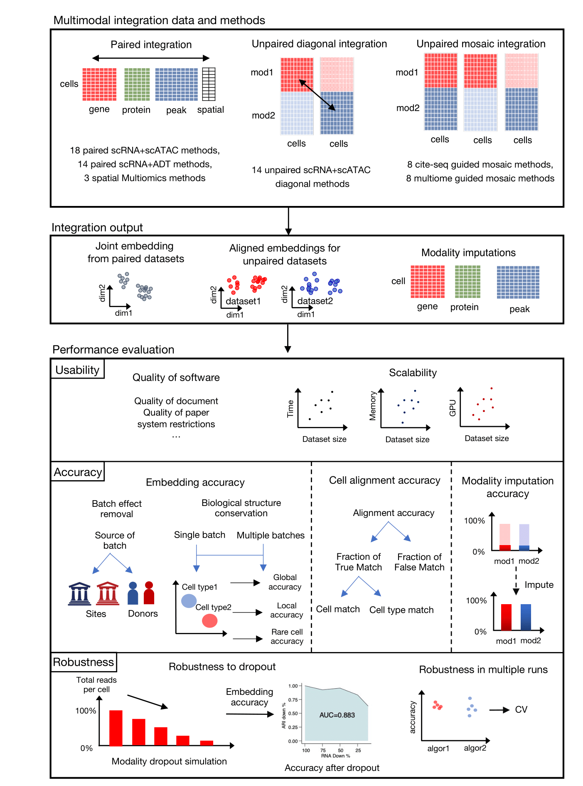

# SCMMI_Benchmark

---------------------------

### SCMMIB introduction

SCMMI_benchmark (SCMMIB) is a benchmark pipeline for evaluating the usability, accuracy, robustness and scalability of single-cell multimodal integration algorithms, including 65 single-cell multi-modal integration methods in 40 algorithms involving modalities of DNA, RNA, protein and spatial multi-omics for paired integration, unpaired diagonal integration, and unpaired mosaic integration.

- This folder contains project introduction and [figure reproducibility code](manuscript_figure_script_and_data) for stage 2 project. The scripts and datasets analyzed in stage 1  are archived in [stage1](https://github.com/bm2-lab/SCMMI_Benchmark/tree/stage1).

- Our website for benchmark results visualization is available at [SCMMIB_website]()
- For reproducibility of benchmark methods, metrics and visualization, we had a GitHub repository at [SCMMIB_pipeline](https://github.com/bm2-lab/SCMMIB_pipeline).

### SCMMIB workflow

### Benchmark datasets summary
All datasets analyzed in SCMMIB study are listed below.
| dataset name       | multi-omics type | Batch                      | species | cell number | tissue                                  |
|--------------------|------------------|----------------------------|---------|-------------|-----------------------------------------|
| BMMC Multiome      | scRNA + scATAC       | 12 donors from 4 sites     | Human   | 69,249      | bone marrow mononuclear cells           |
| BMMC CITE-seq      | scRNA + ADT        | 12 donors from 4  sites    | Human   | 90,261      | bone marrow mononuclear cells           |
| HSPC Multiome      | scRNA + scATAC       | 4 donors  of 5 time points | Human   | 105,942     | hematopoietic stem and progenitor cells |
| HSPC CITE-seq      | scRNA + ADT        | 4 donors of 5 time points  | Human   | 70,988      | hematopoietic stem and progenitor cells |
| SHARE-seq skin     | scRNA + scATAC       | -                          | Mouse   | 34,774      | skin                                    |
| COVID19 CITE-seq   | scRNA + ADT        | 143 donors                 | Human   | 781,123     | peripheral blood immune cells           |
|  10X PBMC   | scRNA + scATAC          | 2 samples                | Human   |  15,021     | peripheral blood immune cells           |
|  10X Mouse Brain   | scRNA + scATAC          | 2 replicates for 2 samples                | Mouse   |  12,138     | brain          |
|  Human white blood cell   | scRNA + ADT          | 8 donors of 3 time points               | Human   |  161,764     |  white blood cell         |
|  10X NSCLC   | scRNA + ADT          | 2 replicates             | Human   |  15,618     |  NSCLC         |
|  10X kidney cancer   | scRNA + ADT          | 7 donor              | Human   |  20,974     |  Kidney         |
| Lymph node spatial | spatial+scRNA+ADT  | 2 samples                  | Human   | 6,843       | lymph node                              |
| Thymus spatial     | spatial+scRNA+ADT  | 4 samples                  | Mouse   | 17,824      | thymus                                  |
| Spleen SPOTS       | spatial+scRNA+ADT  | 2 samples                  | Mouse   | 5,336       | spleen                                  |
 

### Benchmark Methods

| Method                                                                         | Article                                                                   | Time |
|--------------------------------------------------------------------------------|---------------------------------------------------------------------------|------|
| [Liger iNMF](https://github.com/welch-lab/liger)                               | [Cell](https://doi.org/10.1016/j.cell.2019.05.006)                        | 2019 |
| [Seurat v3 CCA](https://github.com/satijalab/seurat)                            | [Cell](https://doi.org/10.1016/j.cell.2019.05.031)                        | 2019 |
| [Seurat v4 RPCA](https://github.com/satijalab/seurat)                           | [Cell](https://doi.org/10.1016/j.cell.2019.05.031)                        | 2019 |
| [Citefuse](https://github.com/SydneyBioX/CiteFuse)                             | [Bioinformatics](https://doi.org/10.1093/bioinformatics/btaa282)          | 2020 |
| [MOFA+](https://github.com/gtca/mofaplus-shiny)                                | [Genome Biology](https://doi.org/10.1186/s13059-020-02015-1)              | 2020 |
| [scAI](https://github.com/sqjin/scAI)                                          | [Genome Biology](https://doi.org/10.1186/s13059-020-1932-8)               | 2020 |
| [unionCom](https://github.com/caokai1073/UnionCom)                             | [Bioinformatics](https://doi.org/10.1093/bioinformatics/btaa443)          | 2020 |
| [cobolt](https://github.com/boyinggong/cobolt/blob/master/docs/tutorial.ipynb) | [Genome Biology](https://doi.org/10.1186/s13059-021-02556-z)              | 2021 |
| [DCCA](https://github.com/cmzuo11/DCCA)                                        | [Bioinformatics](https://doi.org/10.1093/bioinformatics/btab403)          | 2021 |
| [GLUE](https://github.com/gao-lab/GLUE)                                        | [Nature Biotechnology](https://doi.org/10.1101/2021.08.22.457275)         | 2021 |
| [Liger online iNMF](https://github.com/welch-lab/liger)                        | [Nature Biotechnology](https://doi.org/10.1038/s41587-021-00867-x)        | 2021 |
| [scDEC]( https://github.com/kimmo1019/scDEC)                                   | [Nature machine intelligence](https://doi.org/10.1038/s42256-021-00333-y) | 2021 |
| [scMM](https://github.com/kodaim1115/scMM)                                     | [Cell Reports Methods](https://doi.org/10.1016/j.crmeth.2021.100071)      | 2021 |
| [scMVAE](https://github.com/cmzuo11/scMVAE)                                    | [Briefings in Bioinformatics](https://doi.org/10.1093/bib/bbaa287)        | 2021 |
| [Seurat v4 WNN](https://github.com/satijalab/seurat)                            | [Cell](https://doi.org/10.1016/j.cell.2021.04.048)                        | 2021 |
| [totalVI](https://scvi-tools.org/)                                             | [Nature Methods](https://doi.org/10.1038/s41592-020-01050-x)              | 2021 |
| [MultiMAP](https://github.com/Teichlab/MultiMAP)                               | [Genome Biology](https://doi.org/10.1186/s13059-021-02565-y)              | 2021 |
| [bindSC](https://github.com/KChen-lab/bindSC)                                  | [Genome Biology](https://doi.org/10.1186/s13059-022-02679-x)              | 2022 |
| [Liger UiNMF](https://github.com/welch-lab/liger)                              | [Nature Communications](https://doi.org/10.1038/s41467-022-28431-4)       | 2022 |
| [Multigrate](https://github.com/theislab/multigrate)                           | [bioRxiv](https://doi.org/10.1101/2022.03.16.484643)                      | 2022 |
| [Pamona](https://github.com/caokai1073/Pamona)                                 | [Bioinformatics](https://doi.org/10.1093/bioinformatics/btab594)          | 2022 |
| [SAILERX](https://github.com/uci-cbcl/SAILERX)                                 | [Nucleic Acids Research](https://doi.org/10.1093/nar/gkac781)             | 2022 |
| [SCALEX](https://github.com/jsxlei/SCALEX)                                     | [Nature Communications](https://doi.org/10.1038/s41467-022-33758-z)       | 2022 |
| [sciPENN](https://github.com/jlakkis/sciPENN)                                  | [Nature machine intelligence](https://doi.org/10.1038/s42256-022-00545-w) | 2022 |
| [scMDC](https://github.com/xianglin226/scMDC)                                  | [Nature Communications](https://doi.org/10.1038/s41467-022-35031-9)       | 2022 |
| [scMVP](https://github.com/bm2-lab/scMVP)                                      | [Genome Biology](https://doi.org/10.1186/s13059-021-02595-6)              | 2022 |
| [uniPort](https://github.com/caokai1073/uniPort)                               | [Nature Communications](https://doi.org/10.1038/s41467-022-35094-8)       | 2022 |
| [scVAEIT](https://github.com/jaydu1/scVAEIT)                                   | [PNAS](https://doi.org/10.1073/pnas.2214414119)                           | 2022 |
| [MEFISTO](https://biofam.github.io/MOFA2/MEFISTO)                              | [Nature Methods](https://doi.org/10.1038/s41592-021-01343-9)              | 2022 |
| [DeepMAPS](https://github.com/OSU-BMBL/deepmaps)                               | [Nature communications](https://doi.org/10.1038/s41467-023-36559-0)       | 2023 |
| [GCN-SC](https://github.com/YuBinLab-QUST/GCN-SC)                              | [Briefings in Bioinformatics](https://doi.org/10.1093/bib/bbad081)        | 2023 |
| [Maxfuse](https://github.com/shuxiaoc/maxfuse)                                 | [Nature Biotechnology](https://doi.org/10.1038/s41587-023-01935-0)        | 2023 |
| [MultiVI](https://scvi-tools.org/)                                             | [Nature Methods](https://doi.org/10.1038/s41592-023-01909-9)              | 2023 |
| [scMCs](www.sdu-idea.cn/codes.php?name=ScMCs)                                  | [Bioinformatics](https://doi.org/10.1093/bioinformatics/btad133)          | 2023 |
| [SIMBA](https://github.com/pinellolab/simba)                                   | [Nature Methods](https://doi.org/10.1038/s41592-023-01899-8)              | 2023 |
| [Seurat v5 bridge](https://satijalab.org/seurat/)                               | [Nature Methods](https://doi.org/10.1038/s41587-023-01767-y)              | 2023 |
| [Stabmap](https://github.com/MarioniLab/StabMap)                               | [Nature Methods](https://doi.org/10.1038/s41587-023-01766-z)              | 2023 |
| [scMoMaT](https://github.com/PeterZZQ/scMoMaT)                                 | [Nature communications](https://doi.org/10.1038/s41467-023-36066-2)       | 2023 |
| [SpatialGlue](https://github.com/JinmiaoChenLab/SpatialGlue)                   | [bioRxiv](https://doi.org/10.21203/rs.3.rs-2921471/v1)                    | 2023 |
| [MIDAS](https://github.com/labomics/midas)                                     | [Nature Biotechnology](https://doi.org/10.1038/s41587-023-02040-y)        | 2024 |

### SCMMIB manuscript
Our stage1 manuscript "Benchmarking single-cell multi-modal data integrations." was accepted for Nature Methods register  report [figshare folder](https://springernature.figshare.com/registered-reports_nmethods/)

Our stage2 manuscript was submitted.
