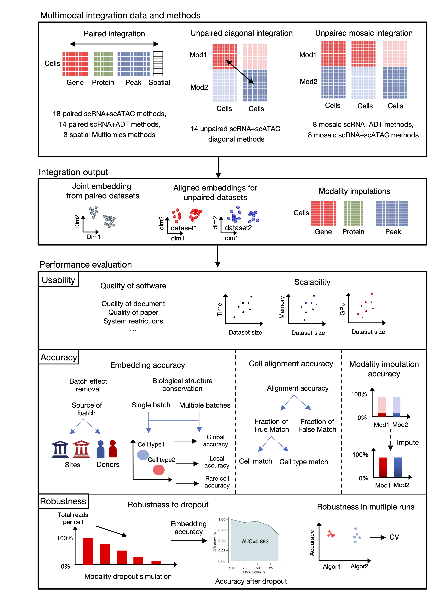

.. SCMMIB documentation master file, created by
    sphinx-quickstart on Tue Oct 22 14:11:22 2024.
    You can adapt this file completely to your liking, but it should at least
    contain the root `toctree` directive.

Welcome to SCMMIB's documentation!
==================================

**scmmib**\  package is designed based on based on scanpy pipeline, which referred to some integration metrics in scib and scglue package, and extended to different single-cell multimodal integration tasks.

.. toctree::
    :maxdepth: 1
    :caption: Contents:
    
    setup
    tutorial
    api

